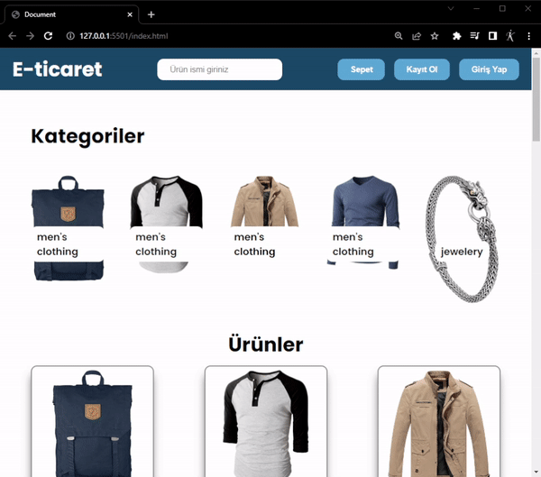

# e_commerce_api
<h3>E-ticaret Sitesi</h3>

Bu projede hazır ürün API'si kullanılarak bilgileri çekildi.

Ürün sepeti kısmı oluşturuldu ve ürün eklenmesi sağlandı.

Sepete çoklu ürün eklenebiliyor ve sepetten ürün silme işlemi yapılıyor

Sepetteki ürün tutarı "Toplam" kısmında belirtiliyor ve ürün fiyatlarıyla bağlantılı çalışıyor.

 ----------   ----------   ----------

<h3>E-commerce Website</h3>

In this project, information is retrieved using a ready-made product API.

The shopping cart section is created, allowing the addition of products.

Multiple products can be added to the cart, and the removal of items from the cart is supported.

The total amount of products in the cart is indicated in the "Total" section and is linked to the product prices.

